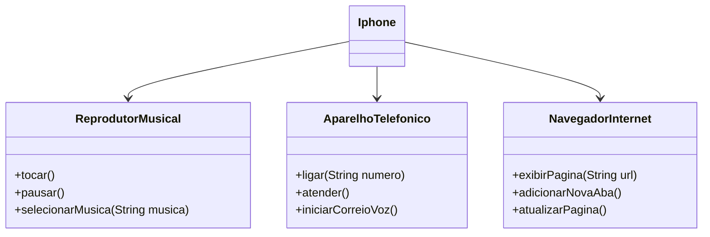

#[DIO](www.dio.me) __Desafio Dio Trilha Java básico__

#### Funcionalidades a Modelar
1. **Reprodutor Musical**
    - Métodos: `tocar()`, `pausar()`, `selecionarMusica(String musica)`
2. **Aparelho Telefônico**
    - Métodos: `ligar(String numero)`, `atender()`, `iniciarCorreioVoz()`
3. **Navegador na Internet**
    - Métodos: `exibirPagina(String url)`, `adicionarNovaAba()`, `atualizarPagina()`

###Exemplo de diagrama UML (Mermaid)
